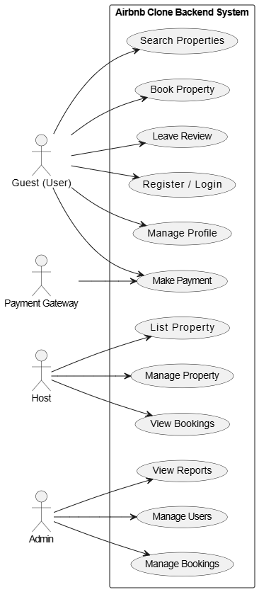

# Airbnb Clone Backend - Use Case Diagram

This document provides a **Use Case Diagram** illustrating how different actors interact with the Airbnb Clone system.

## 🧍 Actors
- **Guest (User):** Can register, search for properties, make bookings, payments, and leave reviews.
- **Host:** Can list, edit, and remove properties, as well as view bookings for their listings.
- **Admin:** Manages users, properties, and system reports.
- **Payment Gateway:** Handles all payment transactions securely.

## ⚙️ Main Use Cases
1. **User Authentication:** Users can sign up, log in, and manage profiles.
2. **Property Management:** Hosts can create and update property listings.
3. **Booking System:** Guests can search, book, and cancel reservations.
4. **Payment Processing:** Payments are handled through an integrated payment gateway.
5. **Review System:** Guests can rate and review properties after booking.
6. **Admin Management:** Admin oversees users, payments, and overall platform health.

## 🧩 Diagram
The use case diagram below visualizes these interactions:

